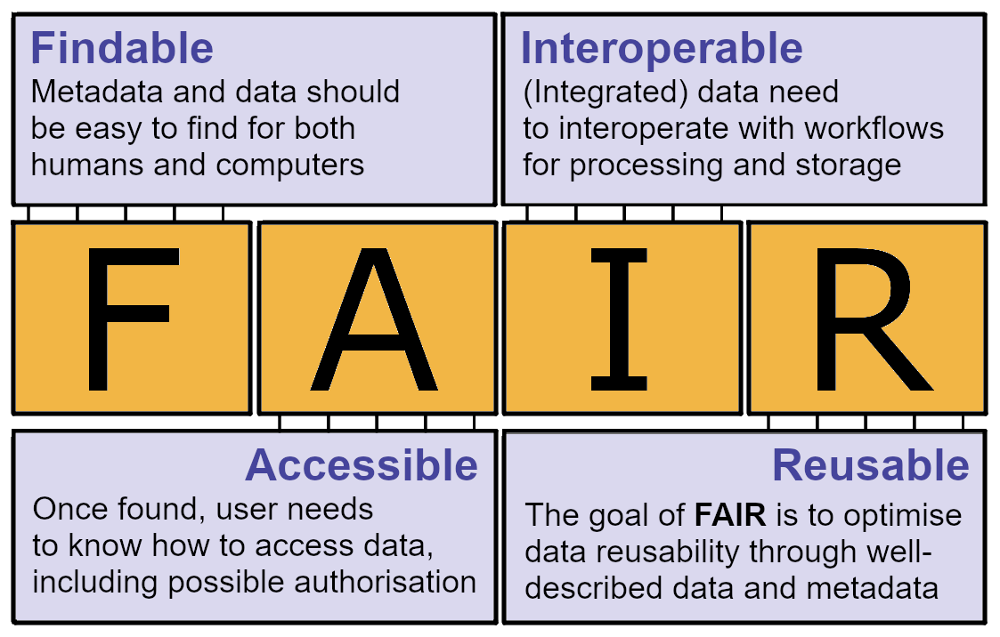

# What are the FAIR guiding principles?

This first introductory learning module will focus on the FAIR guiding principles, as they are central to good data management habits. The principles emphasise machine-actionability (i.e., the capacity of computational systems to find, access, interoperate, and reuse data with none or minimal human intervention) because humans increasingly rely on computational support to deal with data as a result of the increase in volume, complexity, and creation speed of data ([Wilkinson et al, 2016](https://doi.org/10.1038/sdata.2016.18)). 

Before we dive into what FAIR is, a more detailed description of the FAIR principles is given by [Wilkinson et al (2016)](https://doi.org/10.1038/sdata.2016.18).

The FAIR guiding principles. Source: Svalbard Integrated Arctic Earth Observing System (SIOS), licensed CC BY 4.0

## What does "FAIR" stand for?

"FAIR" is short for **F**indable, **A**ccessible, **I**nteroperable, and **R**eusable. These are 4 main concepts, and of these concepts contains multiple guiding principles, of which there are 15 in total. Each section of this introductory learning module is dedicated to one of these concepts, which is also where you can find more detailed information on them.

A short description of the FAIR principles is given below:

### **F**indable (F)
The first step in (re)using data is to find them. Metadata and data should be easy to find for both humans and computers. To ensure that data are findable or discoverable, they need to be uniquely and persistently identifiable through the assignment of a persistent identifier (PID). Moreover, describing the data with rich metadata (i.e. structured and machine-readable documentation) allows to find the data by searching or filtering on the metadata (e.g. all data of the year “2025”, all data from the country “Norway”), most often through online search engines or data repositories which index, harvest or manage the metadata.Machine-readable metadata are essential for automatic discovery of datasets and services, so this is an essential component of the FAIRification process. Assigning a persistent identifier as well as adding metadata to data can be achieved by depositing the data in a data repository.

Source: [Ghent University (last accessed: 06-03-2025)](https://www.ugent.be/en/research/openscience/datamanagement/after-research/fair-data.htm) and [GO FAIR Initiative last accessed: 06-03-2025](https://www.go-fair.org/fair-principles/).

### **A**ccessible (A)
(Meta)data should be retrievable via their persistent identifier (PID) using a standard communications protocol such as https. When necessary, this protocol allows for an authentication and authorization procedure to identify the researcher who accesses the data and to check whether this researcher should be granted access or not. Also, access restrictions and conditions should be clearly specified. Metadata should be available even if the data themselves are not or no longer available.

These rather technical approaches to ensure that data are accessible can be achieved by depositing the data in a data repository. The appropriate access level of the data is chosen by considering possible legal or ethical reasons for restricting data access.

Source: [Ghent University (last accessed: 06-03-2025)](https://www.ugent.be/en/research/openscience/datamanagement/after-research/fair-data.htm) and [GO FAIR Initiative last accessed: 06-03-2025](https://www.go-fair.org/fair-principles/).

### **I**nteroperable (I)
The data usually need to be integrated with other data. In addition, the data need to interoperate with applications or workflows for analysis, storage, and processing. To ensure that different datasets can be linked, aggregated and/or understood properly, recognized standards (formats, languages, vocabularies, ontologies, metadata standards…) should be applied to data and metadata. This allows for the automatic interpretation of the data and metadata by machines, which is essential for the automatic processing of data and metadata.

Source: [Ghent University (last accessed: 06-03-2025)](https://www.ugent.be/en/research/openscience/datamanagement/after-research/fair-data.htm) and [GO FAIR Initiative last accessed: 06-03-2025](https://www.go-fair.org/fair-principles/).

### **R**eusable (R)
The ultimate goal of FAIR is to optimise the reuse of data. To achieve this, metadata and data should be well-described so that they can be replicated and/or combined in different settings.

Source: [Ghent University (last accessed: 06-03-2025)](https://www.ugent.be/en/research/openscience/datamanagement/after-research/fair-data.htm) and [GO FAIR Initiative last accessed: 06-03-2025](https://www.go-fair.org/fair-principles/).

NOTE:

>The principles refer to three types of entities: data (or any digital object), metadata (information about that digital object), and infrastructure. For instance, principle F4 defines that both metadata and data are registered or indexed in a searchable resource (the infrastructure component).

The fairy tale "[A FAIRy tale - A fake story in a trustworthy guide to the FAIR principles for research data](http://zenodo.org/records/2248200#.XkVegPZFxaS)" explains the FAIR guiding principles one by one - in an entertaining, factual and not least educational way.
