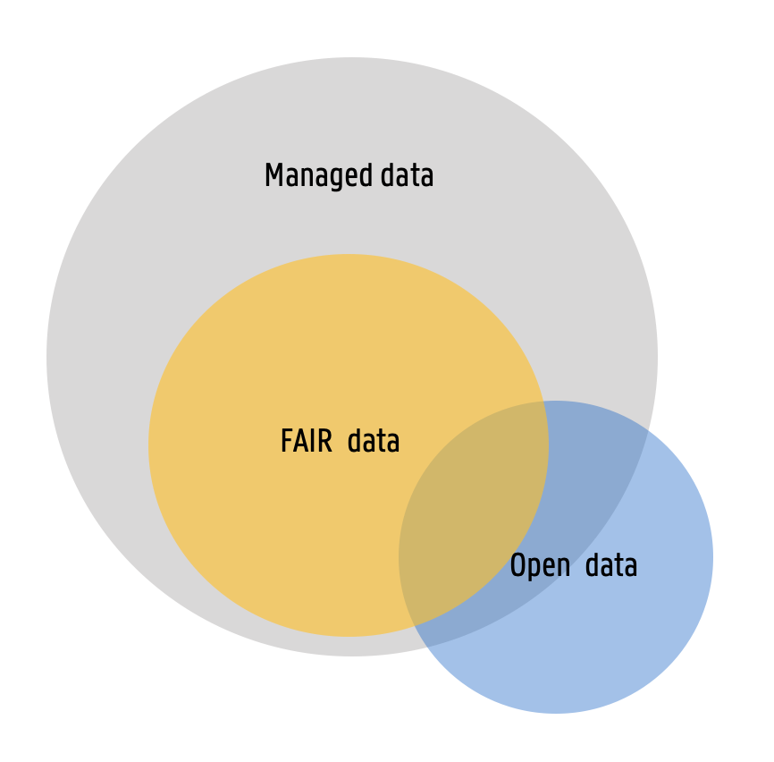

# FAIR data guiding principles in relation to other terms
The FAIR data guiding principles are often compared to and confused with other terms such as open data, open science, and data management. This notebook provides a brief overview of these terms and how they relate to the FAIR data guiding principles.

## Open science
Open science is the movement to make scientific research, data, and their dissemination freely available to anyone, promoting transparency, collaboration, and reproducibility in research practices. Open science encompasses a wide range of practices, including open access publishing, open data, open source software, and open peer review. The FAIR data guiding principles are a key component of open science, ...


<div style="padding:56.21% 0 0 0;position:relative;"><iframe src="https://player.vimeo.com/video/162062013?badge=0&amp;autopause=0&amp;player_id=0&amp;app_id=58479" frameborder="0" allow="autoplay; fullscreen; picture-in-picture; clipboard-write; encrypted-media" style="position:absolute;top:0;left:0;width:100%;height:100%;" title="Vision on Open Science"></iframe></div><script src="https://player.vimeo.com/api/player.js"></script>
<center><em>Vision on Open Science. Source: The Dutch Techcentre for Life Sciences (DTL), last accessed 07-03-2025</em></center>


## Open Data
<center><center>
FAIR versus open data. Source: Image adapted from 'Open data, FAIR data and RDM: the ugly duckling' by S. Jones, licensed under CC BY. Last accessed 07-03-2025.

## Data management

```python

```
