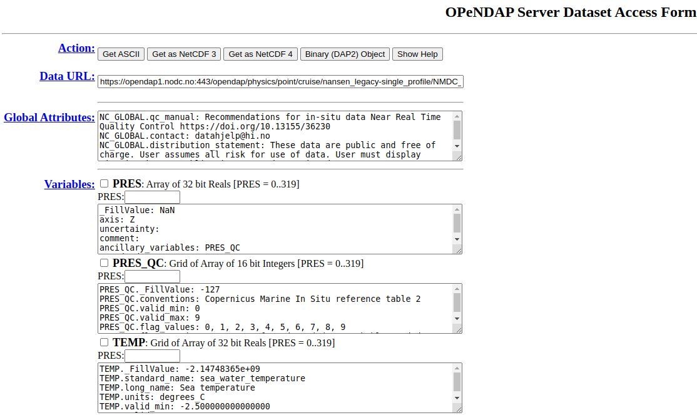
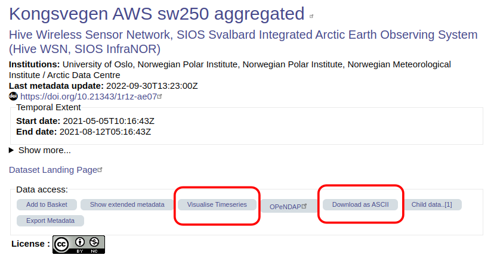

# Data protocols: A convenient approach to using research data on-the-fly?

>NOTE: _This section is work in progress!_

Because CF-NetCDF files are standardised, it is possible for data centres and data access portals to build ways for the user to download the data directly into CSV or ASCII files. This makes it easier for some people to access the data. Whether this is possible or not depends on the data centre/data access portal and the file. Not all services offer such services. This might be something to consider when deciding where you want to publish your own NetCDF file.

Here are some things to look out for. 

### OPeNDAP

You might see that the data are available via OPeNDAP. OPeNDAP, which stands for “Open-source Project for a Network Data Access Protocol,” makes it easier to access and share scientific data over the internet. One advantage of using OPeNDAP is that you don’t need to download the NetCDF file to use the data inside!

The data centre or data access portal can direct you to an OPeNDAP data access form like this one:
https://opendap1.nodc.no/opendap/physics/point/cruise/nansen_legacy-single_profile/NMDC_Nansen-Legacy_PR_CT_58US_2021708/CTD_station_P1_NLEG01-1_-_Nansen_Legacy_Cruise_-_2021_Joint_Cruise_2-1.nc.html

It provides you with a preview of the data, showing you all the variables included as well as the variable and global attributes. It allows you to:
* Download the data to either an ASCII file or a NetCDF file
* Select the checkboxes to access only certain variables
* Select only a subset of each variable by using the text boxes above each variable (after selecting the checkbox)
* You can copy the *Data URL* at the top into your code and use it just like you would do some filepath on your computer. Therefore you can stream the data over the internet without having the download the file to your local computer.

### Custom services

Some data centres or data access portals might allow you to visualise the data on-the-fly on the dataset landing page. They might also include buttons or icons that you can click to download data directly into a CSV or ASCII file.

See this example on the SIOS data access portal:

_Source: [Introduction to CF-NetCDF course by L. Marsden (2022)](https://nordatanet.github.io/Introduction_to_CF-NetCDF/intro.html#how-to-cite-this-course)_

