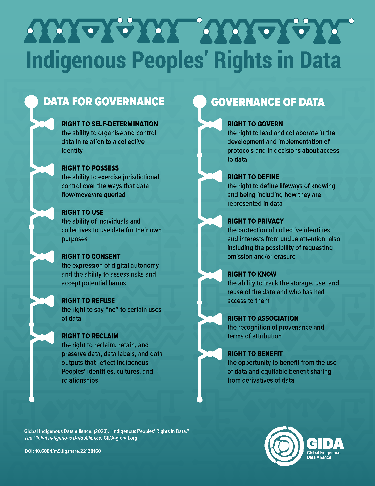

# FAIR is not enough: CARE as an extension to FAIR

**Audience level: Beginner**

**Estimated reading time: 15-20 minutes**

**Contributor: Daan Kivits (SIOS-KC)**

**Date created: 18-06-2026**

**Date last modified: 18-06-2026**

**License: [GNU GENERAL PUBLIC LICENSE Version 3 (AGPLv3)](https://www.gnu.org/licenses/gpl-3.0.html)** 

When working with data involving Indigenous Peoples, adopting the FAIR data principles on their own is not enough. The CARE Principles for Indigenous Data Governance are a necessary extension to the FAIR data principles, because they provide a framework to ensure that data involving Indigenous peoples is managed in ways that respect their rights, interests, and self-determination. CARE provides handles on how data should be collected, shared, and used to empower Indigenous communities and prevent harm. 

---

#### Learning Objectives
By the end of this notebook, you will be able to:
1. Explain the purpose of the CARE principles and their relationship to FAIR.
2. Describe the four pillars of CARE: Collective Benefit, Authority to Control, Responsibility, and Ethics.
3. Recognize examples of ethical and unethical data practices involving Indigenous knowledge.
4. Apply the CARE principles when working with data related to Indigenous communities.

#### Prerequisites
The concept of Indigenous rights and self-determination. Basic familiarity with the FAIR data principles is helpful but not essential. No prior knowledge of data governance is required.

---

#### What are the CARE guiding principles?
TIn the context of the rise of the FAIR Principles in the community of international data infrastructure builders, the [Global Indigenous Data Alliance (GIDA)](https://www.gida-global.org/care) formulated the CARE Principles to address a clear deficit in FAIR regarding Indigenous peoples rights and interests. ‘CARE’ is the acronym for: Collective Benefit, Authority to Control, Responsibility, and Ethics. The CARE Principles for Indigenous Data Governance were developed to address the unique challenges and ethical considerations of managing Indigenous data. They provide guidance on how to collect, share, and use data in ways that respect Indigenous peoples' rights, interests, and self-determination. 

*GIDA has developed a set of rights for Indigenous Peoples’ rights in data. Source: [GIDA](https://doi.org/10.6084/m9.figshare.22138160), licensed CC-BY 4.0.*

### Why are the CARE principles needed? 
Indigenous peoples have historically been excluded from decisions about how their data are collected, used, and shared. The CARE principles address this by:
- Ensuring Indigenous communities **control** their own data.
- Promoting **collective benefit** so that data use aligns with community values and priorities.
- Encouraging **responsibility** and **ethical** practices in data stewardship.
- Supporting compliance with international frameworks like the [United Nations Declaration on the Rights of Indigenous Peoples (UNDRIP)](https://www.un.org/development/desa/indigenouspeoples/declaration-on-the-rights-of-indigenous-peoples.html).

The CARE Principles reflect the crucial role of data in advancing Indigenous innovation and self-determination. They ensure that data movements like the open data movement, whatever they’re advocating and pursuing, respect the people and purpose behind the data.

### How can you ensure your data documentation and sharing practices align with CARE?
#### **Collective Benefit**
*Data ecosystems shall be designed and function in ways that enable Indigenous Peoples to derive benefit from the data.*
   Principle | What to do |
 |-----------|------------|
 | **C1: For inclusive development and innovation** | <u>Bad example</u>: Indigenous communities are excluded from using or reusing data collected about them, limiting their ability to innovate.  <u>What to do</u>: Actively support Indigenous nations and communities in using and reusing data to generate value by establishing foundations for Indigenous innovation and self-determined development. |
 | **C2: For improved governance and citizen engagement** | <u>Bad example</u>: Data about Indigenous communities are used without their input, leading to policies that do not reflect their needs.  <u>What to do</u>: Use data to enrich planning, implementation, and evaluation processes that support Indigenous governance and improve decision-making on matters relating to Indigeneous Peoples. |
 | **C3: For equitable outcomes** | <u>Bad example</u>: Value created from Indigenous data benefits external parties without returning benefits to the community.  <u>What to do</u>: Ensure that any value created from Indigenous data benefits the community in an equitable manner, aligns with their values and promotes their wellbeing. |

#### **Authority to Control**
*Indigenous Peoples' rights and interests in Indigenous data must be recognized, and their authority to control such data must be empowered.*
 | Principle | What to do |
 |-----------|------------|
 | **A1: Recognizing rights and interests** | <u>Bad example</u>: Indigenous data are collected or used without Free, Prior, and Informed Consent (FPIC) from the community.  <u>What to do</u>: Recognize Indigenous Peoples' rights and interests in their data and obtain FPIC for collection and use. Document this from the start when drafting a data policy! |
 | **A2: Data for governance** | <u>Bad example</u>: Indigenous communities lack access to Indigenous data.  <u>What to do</u>: Ensure Indigenous data are accessible to Indigenous nations and communities to support their governance and self-determination. |
 | **A3: Governance of data** | <u>Bad example</u>: Indigenous data are governed by external bodies without Indigenous leadership.  <u>What to do</u>: Support Indigenous Peoples in leading the stewardship of Indigenous data and in developing cultural governance protocols to govern these data. |

#### **Responsibility**
*Those working with Indigenous data have a responsibility to share how those data are used to support Indigenous Peoples' self-determination and collective benefit.*
 | Principle | What to do |
 |-----------|------------|
 | **R1: For positive relationships** | <u>Bad example</u>: Data are used without building relationships based on respect, reciprocity, and trust with Indigenous communities.  <u>What to do</u>: Ensure data creation, interpretation, and use uphold the dignity of Indigenous nations and communities, according to their own values. |
 | **R2: For expanding capability and capacity** | <u>Bad example</u>: Indigenous communities can not practically make use of Indigenous data.  <u>What to do</u>: Support the development of data literacy in Indigenous communities to help enable independent Indigenous data creation, interpretation, use, management, and governance. |
 | **R3: For Indigenous languages and worldviews** | <u>Bad example</u>: Data are not grounded in Indigenous languages, worldviews, or lived experiences.  <u>What to do</u>: Acknowledge the cultural context of Indigenous communities and their languages, worldviews and lived experiences throughout the entire lifetime cycle of the Indigenous data to ensure accurate representation of these data. Provide resources and support to ensure Indigenous data can be accessed and understood in Indigenous langauges. |

#### **Ethics**
*Indigenous Peoples' rights and wellbeing should be the primary concern at all stages of the data lifecycle and across the data ecosystem.*
 | Principle | What to do |
 |-----------|------------|
 | **E1: For minimizing harm and maximizing benefit** | <u>Bad example</u>: data are collected or used in ways that stigmatize or harm Indigenous Peoples.  <u>What to do</u>: Ensure data collection and use align with Indigenous ethical frameworks and UNDRIP, assessing benefits and harms from the community's perspective. |
 | **E2: For justice** | <u>Bad example</u>: Data processes ignore power imbalances or exclude Indigenous representation.  <u>What to do</u>: Address power imbalances and include representation from relevant Indigenous communities in ethical processes. |
 | **E3: For future use** | <u>Bad example</u>: Data governance ignores potential future harm or misuse.  <u>What to do</u>: Account for future use and harm in data governance, including metadata about provenance, purpose, and consent limitations. |

### CARE Self-Assessment Checklist
Before working with Indigenous data, ask yourself:
 | Principle | Question |
 |-----------|----------|
 | **C1** | Does the way I use my data support inclusive development and innovation for Indigenous communities? |
 | **C2** | Does the way I use my data improve governance and citizen engagement of Indigenous communities? |
 | **C3** | Does the way I use my data benefit Indigenous communities and contribute to their understanding of wellbeing? |
 | **A1** | Have I recognized Indigenous rights and interests in the data and included them when making the data policy? |
 | **A2** | Have I enabled the Indigeneous communities to use my data to support their self-governance and self-determination? |
 | **A3** | Have I enabled the Indigeneous communities to lead the stewardship over my data and develop cultural governance protocols for my data? |
 | **R1** | Have I built positive relationships with Indigenous communities during the creation, interpretation, and use of my data? |
 | **R2** | Have I supported capacity-building and data literacy in Indigenous communities? |
 | **R3** | Does the way I use my data reflect Indigenous languages, worldviews and lived experiences, and have I acknowledged the cultural context of my data? |
 | **E1** | Have I minimized harm and maximized benefit for Indigenous communities during the creation, interpretation, and use of my data? |
 | **E2** | Have I addressed power imbalances and ensured Indigenous representation in any ethical decisions related to my data? |
 | **E3** | Have I considered future use and potential harm in the governance of my data? |

### CARE and FAIR: Complementary Frameworks
The **CARE principles** are not a replacement for **FAIR** but rather an **extension** that addresses ethical and cultural considerations. While FAIR focuses on technical aspects of data sharing, CARE ensures that data practices are **ethical, inclusive, and respectful** of Indigenous rights.
 | **FAIR** | **CARE** |
 |----------|----------|
 | Focuses on making data *Findable, Accessible, Interoperable, and Reusable*. | Focuses on *Collective Benefit, Authority to Control, Responsibility, and Ethics*. |
 | Technical guidance for data management. | Ethical and legal guidance for data governance. |
 | Applies to all data. | Specifically addresses Indigenous data. |

For data involving Indigenous peoples, both FAIR and CARE should be applied together to ensure data are both technically and ethically sound.

## References used in this notebook
Hudson Mauiet et al. *Indigenous Peoples' Rights in Data: a contribution toward Indigenous Research Sovereignty*. (2023).  Frontiers in Research Metrics and Analytics. 8. DOI=10.3389/frma.2023.1173805  https://www.frontiersin.org/articles/10.3389/frma.2023.1173805

Australian Research Data Commons. (2025). *CARE Principles for Indigenous Data Governance*. https://ardc.edu.au/resource/the-care-principles/
